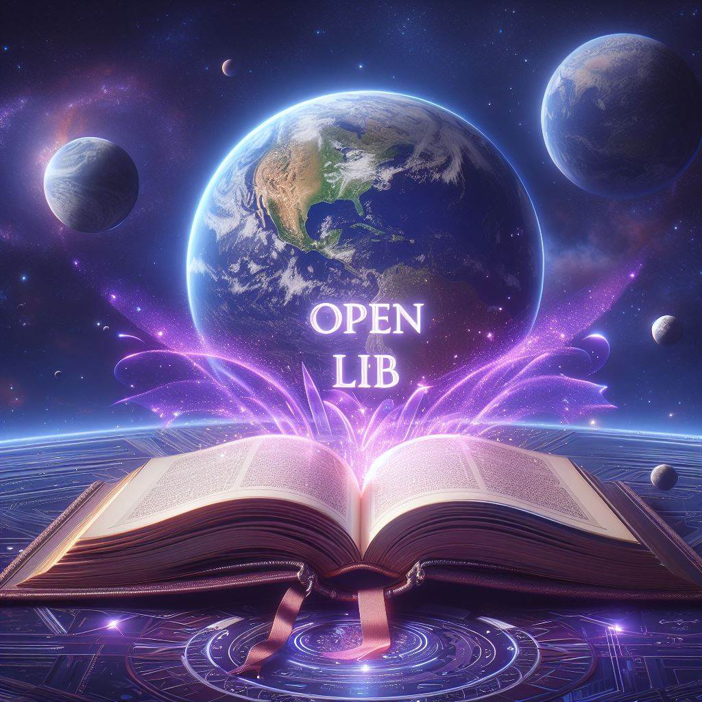

# OpenLib (Open Library) - Student Learning Book Creator

*(Provisional Logo)*

The OpenLib (Open Library) is a Python script designed to empower educators and learners worldwide by facilitating the creation of educational materials tailored to diverse student needs. Whether you're a teacher crafting resources for your classroom or an individual passionate about sharing knowledge, this tool aims to assist you in creating engaging and effective learning materials.

## Motivation

Education is the cornerstone of progress and empowerment, yet access to quality educational resources remains unevenly distributed worldwide. The OpenLib (Open Library) seeks to bridge this gap by enabling educators and content creators to develop educational materials that cater to the unique needs and backgrounds of students across the globe. Our mission is to democratize access to education and empower learners of all ages and backgrounds to reach their full potential.

## Requirements

- Python 3.x
- `tkinter` library (usually included with Python)
- `docx` library (install using `pip install python-docx`)
- `g4f` library (install using `pip install g4f`)
- An internet connection for AI assistance

## Usage

1. **Running the Script:**
   - Execute the script by running the `main()` function within the Python environment.
   - The script launches a user-friendly graphical interface (GUI) to guide you through the book creation process.

2. **Entering Book Details:**
   - Input the topic of the educational book in the designated field.
   - Select the appropriate student experience level from the available options (Elementary School, Middle School, High School, University).
   - Choose the language of the book from the supported languages: English, German, French, Spanish, Italian.

3. **Initiating Book Creation:**
   - Click the "Start Book Creation" button to commence the book generation process.
   - The script employs AI assistance to craft the book's outline and content, tailored to the specified topic, student educational level, and language.
   - Upon completion, a confirmation message will signify the successful creation of the book.

4. **Output:**
   - The generated Microsoft Word document will be saved in the current directory, with the sanitized book title serving as the filename.

## Planned Features

- **Online Hosting:** Explore the possibility of hosting the tool online to allow for easier access and collaboration among educators and learners worldwide.
- **Audio Book Variant:** Integrate functionality to convert the generated books into audio formats, enhancing accessibility for visually impaired learners and those who prefer auditory learning.
- **Multilanguage Support Expansion:** Aim to add support for additional languages in future updates, further catering to diverse linguistic communities and promoting global accessibility.

## Acknowledgements

The development of the OpenLib (Open Library) would not have been possible without the invaluable contributions of the open-source community. I am particularly grateful to the creators of GPT-4-Free by xtekky, another remarkable GitHub project. GPT-4-Free provides the AI assistance that powers this tool, enabling the generation of educational content tailored to students' needs. My sincere gratitude goes to the developers and contributors behind GPT-4-Free for their dedication to advancing AI technology and education accessibility.

## Future Possibilities

The OpenLib (Open Library) is a dynamic project with boundless potential. Here are some future directions and possibilities:
- Integration with learning management systems (LMS) for seamless classroom integration.
- Collaboration features to facilitate co-authoring and peer review of educational materials.
- Advanced AI capabilities for personalized learning experiences tailored to individual student needs.

We envision a future where education knows no boundaries, where every learner has access to high-quality educational resources that inspire, engage, and empower. Join us in this journey towards a brighter, more inclusive future for education worldwide.
